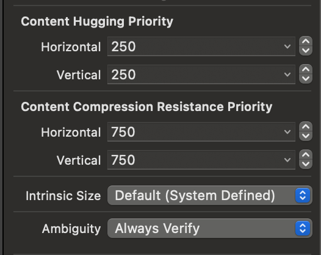

# Today I Learn

- Date: 2023/5/19

## AutoLayout Content Hugging Priority, Content Compression Resistance Priority



- Storyboard, Nib으로 UI 구성을 할 경우 제약을 두어 구현한다.
- Content Hugging Priority, Content Compression Resistance Priority의 경우, UI의 상호 관계에서, 우선 순위를 정할 때 사용된다.

### Content Hugging Priority
> Sets the priority with which a view resists being made larger than its intrinsic size.
> 뷰가 고유 크기보다 커지지 않도록 하는 우선 순위를 설정합니다.

출처 : apple developer site [link](https://developer.apple.com/documentation/uikit/uiview/1622485-setcontenthuggingpriority)

코드로 아래와 같이 설정할 수도 있다.
```swift
label.setContentHuggingPriority(.defaultHigh, for: .horizontal)
```

### Content Compression Resistance Priority

> Sets the priority with which a view resists being made smaller than its intrinsic size.
> 뷰가 고유 크기보다 작게 만들어지지 않도록 하는 우선 순위를 설정합니다.

출처 : apple developer site [link](https://developer.apple.com/documentation/uikit/uiview/1622526-setcontentcompressionresistancep)

코드로 아래와 같이 설정할 수도 있다.
```swift
label.setContentCompressionResistancePriority(.defaultLow, for: .horizontal)
```

