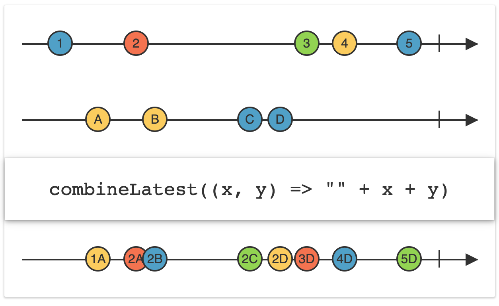

# Today I Learn

- Date: 2023/5/30

## RxSwift - CombineLatest

### CombineLatest
[출처] ReactiveX - CombineLatest [link](https://reactivex.io/documentation/operators/combinelatest.html)

when an item si emitted by either of two Observables, combine the latest item emitted by each Observable via a specified function and emit items based on the results of this function

두 개의 Observable 중 하나가 항목을 배출할 때 배출된 마지막 항목과 다른 한 Observable이 배출한 항목을 결합한 후 함수를 적용하여 실행 후 실행된 결과를 배출한다



#### 목적
- RxSwift에서  입력한 조건들이 여러가지 일 때, 그 입력을 합해서 하나의 object로 만들고, 그 object를 배출하는 테스트임.
-  `InputParameter`의 경우  `aButtonSelected`, `bButtonSelected`, `largeAreaID`, `smallAreaID`, `title`의  property를 갖는다.
- View에서 입력된 값을 바탕으로 statusRelay를 통해 view에 표현 하는 간단한 실헙이다.
- 여기서 주목할 것은 ViewModel에서 각각 입력된 값을 combineLatest로 받고, map을 통해 inputParameter로 변환하고,
- statusRelay에 bind한다.
- ViewController에서 viewModel의 statusRelay를 string으로 변환시키고, statusLabel에 bind 하여 표현할 수 있다.


### Model

```swift
struct InputParameter {
  var aButtonSelected: Bool? = nil
  var bButtonSelected: Bool? = nil
  var largeAreaID: String? = nil
  var smallAreaID: String? = nil
  var title: String? = nil
}
```

### ViewModel

```swift
final class MainViewModel {
  
  let disposeBag = DisposeBag()
  
  // VM -> View
  
  let statusRelay = PublishRelay<InputParameter>()
  
  // View -> VM
  
  let aButtonRelay = BehaviorRelay<Bool>(value: false)
  let bButtonRelay = BehaviorRelay<Bool>(value: false)
  let largeAreaRelay = BehaviorRelay<String>(value: "")
  let smallAreaRelay = BehaviorRelay<String>(value: "")
  let titleAreaRelay = BehaviorRelay<String>(value: "")
  
  init() {
    bind()
  }
  
  func bind() {
    Observable.combineLatest(
      aButtonRelay,
      bButtonRelay,
      largeAreaRelay,
      smallAreaRelay,
      titleAreaRelay
    )
    .map {
      InputParameter(
        aButtonSelected: $0.0,
        bButtonSelected: $0.1,
        largeAreaID: $0.2,
        smallAreaID: $0.3,
        title: $0.4)
    }
    .bind(to: statusRelay)
    .disposed(by: disposeBag)
  }
}
```

### ViewController

```swift
final class MainViewController: UIViewController {
  
  // MARK: - Properties
  
  let disposeBag = DisposeBag()
  
  private lazy var aButton = UIButton(type: .system).then {
    $0.setTitle("A Button", for: .normal)
  }
  
  private lazy var bButton = UIButton(type: .system).then {
    $0.setTitle("B Button", for: .normal)
  }
  
  private lazy var largeAreaTextField = UITextField().then {
    $0.borderStyle = .roundedRect
    $0.placeholder = "Large area"
  }
  
  private lazy var smallAreaTextField = UITextField().then {
    $0.borderStyle = .roundedRect
    $0.placeholder = "Small area"
  }
  
  private lazy var titleTextField = UITextField().then {
    $0.borderStyle = .roundedRect
    $0.placeholder = "title"
  }
  
  private lazy var statusLabel = UILabel().then {
    $0.font = .systemFont(ofSize: 10.0)
    $0.numberOfLines = 0
  }
  
  private lazy var stackView: UIStackView = {
    let arrangedSubviews = [
      statusLabel,
      aButton, bButton, largeAreaTextField, smallAreaTextField, titleTextField
    ]
    let stackView = UIStackView(arrangedSubviews: arrangedSubviews)
    stackView.axis = .vertical
    stackView.spacing = 8.0
    stackView.distribution = .equalSpacing
    return stackView
  }()
  
  let viewModel = MainViewModel()
  
  // MARK: - Initializers
  
  override init(nibName nibNameOrNil: String?, bundle nibBundleOrNil: Bundle?) {
    super.init(nibName: nibNameOrNil, bundle: nibBundleOrNil)
    attribute()
    layout()
  }
  
  required init?(coder: NSCoder) {
    fatalError("init(coder:) has not been implemented")
  }
  
  // MARK: - View Life Cycle
  
  override func viewDidLoad() {
    super.viewDidLoad()
    setupNavigationBar()
    bind()
  }
  
  // MARK: - Setup Methods
  
  func setupNavigationBar() {
    title = "Combine Parameters"
  }
  
  private func bind() {
    aButton.rx.tap
      .map { self.aButton.isSelected.toggle() }
      .map { self.aButton.isSelected ? true : false }
      .bind(to: viewModel.aButtonRelay)
      .disposed(by: disposeBag)
    
    bButton.rx.tap
      .map { self.bButton.isSelected.toggle() }
      .map { self.bButton.isSelected ? true : false }
      .bind(to: viewModel.bButtonRelay)
      .disposed(by: disposeBag)
    
    largeAreaTextField.rx.text.orEmpty
      .bind(to: viewModel.largeAreaRelay)
      .disposed(by: disposeBag)
    
    smallAreaTextField.rx.text.orEmpty
      .bind(to: viewModel.largeAreaRelay)
      .disposed(by: disposeBag)
    
    titleTextField.rx.text.orEmpty
      .bind(to: viewModel.largeAreaRelay)
      .disposed(by: disposeBag)
    
    viewModel.statusRelay
      .map { "\($0)" }
      .bind(to: statusLabel.rx.text)
      .disposed(by: disposeBag)
  }
  
  private func attribute() {
    view.backgroundColor = .white
  }
  
  private func layout() {
    view.addSubview(stackView)
    stackView.snp.makeConstraints {
      $0.top.equalToSuperview().inset(200.0)
      $0.leading.trailing.equalToSuperview().inset(20.0)
      $0.bottom.equalToSuperview().inset(400.0)
    }
  }
}
```