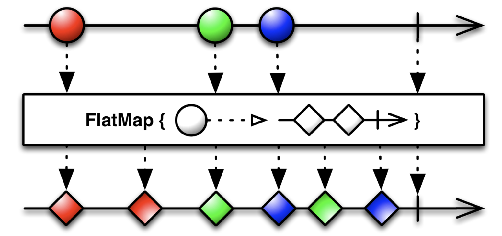

# Today I Learn

- Date: 2023/5/29

## RxSwift - FlatMap

### FlatMap
[출처] ReactiveX - FlatMap [link](https://reactivex.io/documentation/operators/flatmap.html)

transform the items emitted by an Observable into Observables, then flatten the emissions from those into a single Observable

Observable이 내보낸 항목을 Observable로 변환한 다음 해당 항목의 내보낸 항목을 단일 Observable로 평평하게 만듭니다.



### `flatMap`

```swift
extension ObservableType {

    /**
     Projects each element of an observable sequence to an observable sequence and merges the resulting observable sequences into one observable sequence.

     - seealso: [flatMap operator on reactivex.io](http://reactivex.io/documentation/operators/flatmap.html)

     - parameter selector: A transform function to apply to each element.
     - returns: An observable sequence whose elements are the result of invoking the one-to-many transform function on each element of the input sequence.
     */
    public func flatMap<Source: ObservableConvertibleType>(_ selector: @escaping (Element) throws -> Source)
        -> Observable<Source.Element> {
            return FlatMap(source: self.asObservable(), selector: selector)
    }

}
```

### `class FlatMap`

```swift
final private class FlatMap<SourceElement, SourceSequence: ObservableConvertibleType>: Producer<SourceSequence.Element> {
    typealias Selector = (SourceElement) throws -> SourceSequence

    private let source: Observable<SourceElement>
    
    private let selector: Selector

    init(source: Observable<SourceElement>, selector: @escaping Selector) {
        self.source = source
        self.selector = selector
    }
    
    override func run<Observer: ObserverType>(_ observer: Observer, cancel: Cancelable) -> (sink: Disposable, subscription: Disposable) where Observer.Element == SourceSequence.Element {
        let sink = FlatMapSink(selector: self.selector, observer: observer, cancel: cancel)
        let subscription = sink.run(self.source)
        return (sink: sink, subscription: subscription)
    }
}
```


* 예시 1

```swift
example(of: "flatMap") {
  let disposeBag = DisposeBag()
  
  let numbers = Observable.from([1, 2, 3])
  let multiples = { n in Observable.from([n * 2, n * 3]) }

  // #1
  numbers.flatMap(multiples)
    .subscribe(onNext: {
      print($0)
    })
    .disposed(by: disposeBag)
  // #2
  numbers
    .flatMap { n in Observable.from([ n * 2, n * 3]) }
    .subscribe(onNext: { print($0) })
    .disposed(by: disposeBag)
}
```

* 결과

```
--- Example of: flatMap ---
2
3
4
6
6
9
```

* 예시 2

```swift
example(of: "flatMap example2") {
  let disposeBag = DisposeBag()
  let results = BehaviorSubject<[String]>(value: [])
  
  let trigger = PublishSubject<String>()
  
  trigger.flatMap { string -> Observable<[String]> in
    return fetchData()
  }
  .asObservable()
  .subscribe(onNext: {
    print($0)
  })
  .disposed(by: disposeBag)
  
  trigger.onNext("first fetch")
  trigger.onNext("second fetch")
  trigger.onNext("third fetch")
  trigger.onNext("4th fetch")
}

func fetchData() -> Observable<[String]> {
  return Observable<[String]>.create { observer in
    let randomNumber = (0...10).randomElement()
    observer.onNext(["Hello", "world", "\(randomNumber)"])
    observer.onCompleted()
    return Disposables.create()
  }  
}
```

* 결과

```
--- Example of: flatMap example2 ---
["Hello", "world", "Optional(8)"]
["Hello", "world", "Optional(6)"]
["Hello", "world", "Optional(3)"]
["Hello", "world", "Optional(6)"]
```
