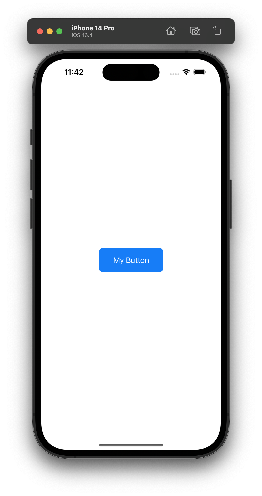

# Today I Learn

- Date: 2023/06/03

## SwiftUI - ButtonStyle

[출처] [link](https://developer.apple.com/documentation/swiftui/buttonstyle)

* SwiftUI에 Button에 스타일을 커스텀으로 구현할 수 있다.
* 이 때, ButtonStyle을 채택하여 구현 가능하다.
* ButtonStyle은 `func makeBody(configuration: Self.Configuration) -> Self.Body' 안에 우리가 원하는 스타일을 구현가능하다.
* 원 소스는 다음과 같다.

```swift
/// A type that applies standard interaction behavior and a custom appearance to
/// all buttons within a view hierarchy.
///
/// To configure the current button style for a view hierarchy, use the
/// ``View/buttonStyle(_:)-7qx1`` modifier. Specify a style that conforms to
/// `ButtonStyle` when creating a button that uses the standard button
/// interaction behavior defined for each platform. To create a button with
/// custom interaction behavior, use ``PrimitiveButtonStyle`` instead.
@available(iOS 13.0, macOS 10.15, tvOS 13.0, watchOS 6.0, *)
public protocol ButtonStyle {

    /// A view that represents the body of a button.
    associatedtype Body : View

    /// Creates a view that represents the body of a button.
    ///
    /// The system calls this method for each ``Button`` instance in a view
    /// hierarchy where this style is the current button style.
    ///
    /// - Parameter configuration : The properties of the button.
    @ViewBuilder func makeBody(configuration: Self.Configuration) -> Self.Body

    /// The properties of a button.
    typealias Configuration = ButtonStyleConfiguration
}
```

#### 구현 방법은 아래와 같다.

```swift
import SwiftUI

struct MyButtonStyle: ButtonStyle {
  
  let backgroundColor: Color
  let textColor: Color
  
  func makeBody(configuration: Configuration) -> some View {
    HStack {
      Spacer()
      configuration.label.foregroundColor(textColor)
        .lineLimit(2)
        .minimumScaleFactor(0.7)
      Spacer()
    }
    .padding()
    .background(backgroundColor.cornerRadius(8))
    .scaleEffect(configuration.isPressed ? 0.95 : 1)
  }
  
  init(backgroundColor: Color = .blue, textColor: Color = .white) {
    self.backgroundColor = backgroundColor
    self.textColor = textColor
  }
}
```
#### 적용 방법은 일반 스위프트 모디파이어를 이용하듯 사용하면 된다.

```swift
Button(action: { print("Button Tapped")}, label: { Text("My Button") })
     .buttonStyle(MyButtonStyle())

``` 
 
#### 구현 결과
 
 