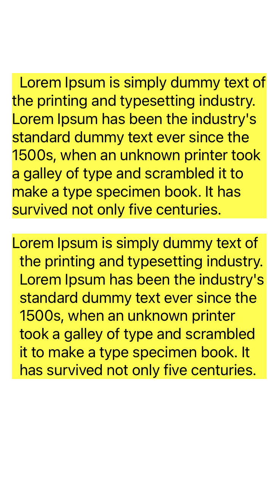

# Today I Learn

- Date: 2023/06/08

## UILabel에서 들여쓰기와 내어쓰기

### firstLineHeadIndent
* The indentation of the first line of the paragraph.
* firstLineHeadIndent [link](https://developer.apple.com/documentation/uikit/nsmutableparagraphstyle/1528392-firstlineheadindent)

### headIndent
* The indentation of the paragraph’s lines other than the first.
* headIndent [link](https://developer.apple.com/documentation/uikit/nsmutableparagraphstyle/1525135-headindent)

* `headIndent`로 들여쓰기를 설정할 수 있다.
* `firstLineHeadIndent`를 통해서 들여쓰기/내어쓰기를 설정할 수 있다.


### UILabel에서 들여쓰기, 내어쓰기를 하는 예제 코드

```swift
//: A UIKit based Playground for presenting user interface

import UIKit
import PlaygroundSupport

class MyViewController : UIViewController {
  
  let text = "Lorem Ipsum is simply dummy text of the printing and typesetting industry. Lorem Ipsum has been the industry's standard dummy text ever since the 1500s, when an unknown printer took a galley of type and scrambled it to make a type specimen book. It has survived not only five centuries."
  
  override func loadView() {
    let view = UIView()
    view.backgroundColor = .white
    let label1 = UILabel()
    label1.numberOfLines = 0
    let label2 = UILabel()
    label1.attributedText = NSAttributedString(string: text, attributes: Const.labelOneAttributes())
    label2.attributedText = NSAttributedString(string: text, attributes: Const.labelTwoAttributes())
    label2.numberOfLines = 0
    view.addSubview(label1)
    view.addSubview(label2)
    
    label1.translatesAutoresizingMaskIntoConstraints = false
    label2.translatesAutoresizingMaskIntoConstraints = false
    let inset: CGFloat = 20.0
    NSLayoutConstraint.activate([
      label1.topAnchor.constraint(equalTo: view.topAnchor, constant: 100.0),
      label1.leadingAnchor.constraint(equalTo: view.leadingAnchor, constant: inset),
      label1.trailingAnchor.constraint(equalTo: view.trailingAnchor, constant: -inset)
    ])
    NSLayoutConstraint.activate([
      label2.topAnchor.constraint(equalTo: label1.bottomAnchor, constant: inset),
      label2.leadingAnchor.constraint(equalTo: view.leadingAnchor, constant: inset),
      label2.trailingAnchor.constraint(equalTo: view.trailingAnchor, constant: -inset)
    ])
    [label1, label2].forEach {
      $0.backgroundColor = .yellow
    }
    self.view = view
  }
}

extension MyViewController {
  struct Const {
    static func labelOneAttributes() -> [NSAttributedString.Key: Any] {
      let paragraphStyle = NSMutableParagraphStyle()
      paragraphStyle.firstLineHeadIndent = 10.0
      return [
        .font: UIFont.systemFont(ofSize: 20.0),
        .foregroundColor: UIColor.black,
        .paragraphStyle: paragraphStyle
      ]
    }
    
    static func labelTwoAttributes() -> [NSAttributedString.Key: Any] {
      let paragraphStyle = NSMutableParagraphStyle()
      paragraphStyle.firstLineHeadIndent = -10.0
      paragraphStyle.headIndent = 10.0
      return [
        .font: UIFont.systemFont(ofSize: 20.0),
        .foregroundColor: UIColor.black,
        .paragraphStyle: paragraphStyle
      ]
    }
  }
}

// Present the view controller in the Live View window
PlaygroundPage.current.liveView = MyViewController()
```

### 결과 

